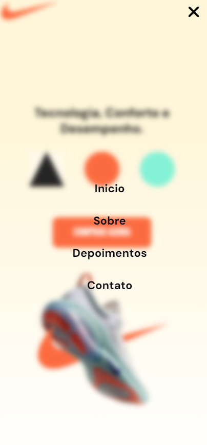
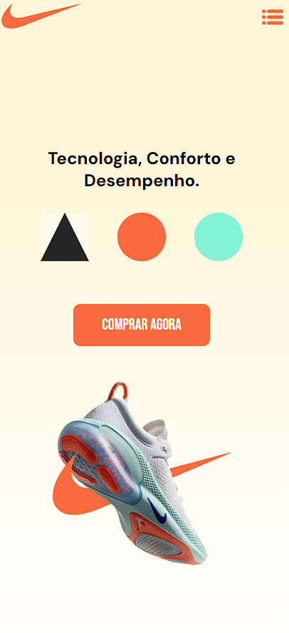
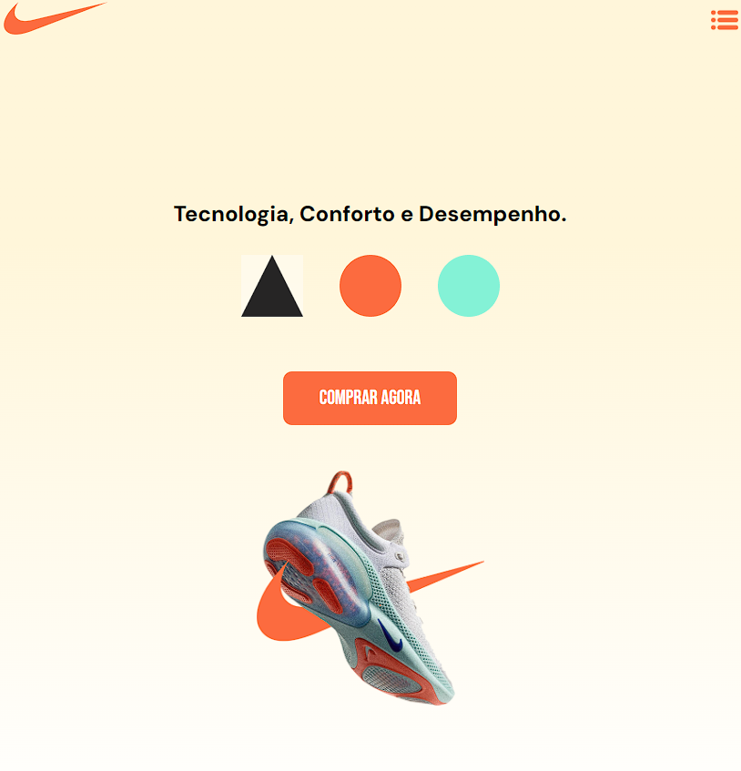
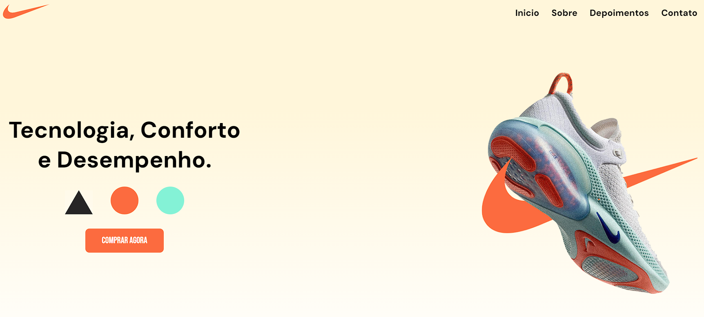

<h1 align="center">:triangular_ruler: Landing Page Nike JoyRide</h1>

# :memo: Índice
* [:chart_with_upwards_trend: Proposta]()
* [:trophy: Desafio]()
* [:hammer_and_wrench: Tecnologias]()
* [:dart: Objetivo]()
* [:open_book: Aprendizado]()
* [:camera: Imagens do Projeto]()
* 1. [:iphone: :computer: :desktop_computer:Responsividade]()
* 2. [:movie_camera: Vídeo Apresentação do Projeto]()
* 3. [:iphone: Mobile]()
* 4. [:computer: Tablet]()
* 5. [:desktop_computer: Desktop / Notebook]()
* [:link: Links]()
* [:technologist: Autor]()

<h1 align="center">:chart_with_upwards_trend: Proposta</h1>
<h3 align="center">Criar uma Landing Page </h3>

<h1 align="center">:trophy: Desafio</h1>
<h3 align="center">Meu maior desafio foi o meu maior aprendizado que foi o uso das medias queries, sempre tive dificuldade em aplicar responsividade aos meus projetos, mas agora é algo que faz mais sentido para mim.</h3>

<h1 align="center">:hammer_and_wrench: Tecnologias</h1>
<h3 align="center">JavaScript</h3>
<h3 align="center">HTML5</h3>
<h3 align="center">CSS3</h3>

<h1 align="center">:dart: Objetivo</h1>
<h3 align="center">Desenvolver uma página completa com section, scroll menu, responsividade.</h3>

<h1 align="center">:open_book: Aprendizado</h1>
<h3 align="center">O meu maior aprendizado nesse projeto foi me dispor das media queries e aplicar responsividade no meu projeto sem o auxilio de exemplo nenhum, foi bastante complicado mas conseguir concluir.</h3>

<h1 align="center">:camera: Imagens do Projeto</h1>

<h3 align="center">Imagem 1</h3>

<h3 align="center">Imagem 2</h3>

<h3 align="center">Imagem 3</h3>

<h3 align="center">Imagem 4</h3>

<h1 align="center">:movie_camera: Vídeo Apresentação do Projeto</h1>

<h1 align="center">Responsividade :iphone: :computer: :desktop_computer:</h1>

<h1 align="center">:iphone: Mobile</h1>

<h1 align="center">:computer: Tablet</h1>

<h1 align="center">:desktop_computer: Desktop / Notebook</h1>

<h1 align="center">:link: Links</h1>
<h3 align="center">Deploy Vercel -  https://landing-page-nike-joy-ride.vercel.app/ </h3>

<h1 align="center">:technologist: Autor</h1>
<h3 align="center">LinkedIn - https://www.linkedin.com/in/rodrigobarros2802/</h3>

<h3 align="center">GitHub - https://github.com/rodrigobarros2802</h3> 

<h3 align="center">Portfólio Online - https://rodrigobarros2802.github.io/my-portfolio/</h3>

